# Anupama Nair — AI Persona Agent System

An end-to-end AI agent built to represent **Anupama Nair** during the **Scaler AI Engineer Intern** application process. Recruiters and interviewers can interact through a chat UI or a live phone call; the agent answers questions about Anupama's background, projects, and skills — and can schedule a real interview slot on her calendar.

---

## Architecture

```mermaid
flowchart TD
    subgraph Chat["💬 Chat Flow"]
        U1["User / Browser"]
        UI["Chat UI\n(Vercel)"]
        CHAT_API["/api/chat\n(Next.js API Route)"]
        RAG["RAG Microservice\n(Railway · FastAPI)"]
        CHROMA["Chroma DB\n(Vector Store)"]
        GEMINI["Google Gemini\n1.5 Flash"]

        U1 -->|HTTPS| UI
        UI -->|POST /api/chat| CHAT_API
        CHAT_API -->|semantic search| RAG
        RAG <-->|embed + query| CHROMA
        CHAT_API -->|augmented prompt| GEMINI
        GEMINI -->|streamed response| CHAT_API
        CHAT_API -->|SSE stream| UI
    end

    subgraph Voice["📞 Voice Flow"]
        U2["Caller"]
        VAPI_NUM["Vapi Phone Number"]
        VAPI_ORCH["Vapi Orchestration\n(STT → LLM → TTS)"]
        FUNC_SVC["Function Service\n(Railway · FastAPI)"]
        CAL["Cal.com API"]
        BOOKING["/api/booking\n(Cal.com webhook)"]

        U2 -->|PSTN call| VAPI_NUM
        VAPI_NUM --> VAPI_ORCH
        VAPI_ORCH -->|function call| FUNC_SVC
        FUNC_SVC -->|get slots / book| CAL
        CAL -->|booking confirmed| FUNC_SVC
        FUNC_SVC -->|result string| VAPI_ORCH
        CAL -->|webhook| BOOKING
    end
```



---

## Quick Start

### Prerequisites

- Node.js 18+, Python 3.11+
- API keys for Google Gemini, Vapi, ElevenLabs, Deepgram, Cal.com
- A [Vercel](https://vercel.com) account (free hobby tier)
- A [Railway](https://railway.app) account (free 500 hr/mo tier)

### Steps

```bash
# 1. Clone the repository
git clone https://github.com/<your-handle>/scalar.git
cd scalar

# 2. Configure environment variables
cp .env.example .env.local
#    Open .env.local and fill in all required API keys (see table below)

# 3. Set up the Python RAG environment
cd rag
python -m venv .venv && source .venv/bin/activate
pip install -r requirements.txt

# 4. Run document ingestion (one-time)
python ingest.py

# 5. Start the RAG API locally
uvicorn api:app --host 0.0.0.0 --port 8000 --reload

# 6. Set up and run the Chat UI (new terminal)
cd ../chat-ui
npm install
npm run dev
#    Open http://localhost:3000

# 7. Deploy to production
#    a. Push to GitHub
git push origin main
#    b. Import project on Vercel → add all env vars → Deploy
#    c. Import RAG service on Railway → set env vars → Deploy

# 8. Set up the Voice Agent
cd ../voice
pip install -r requirements.txt
#    Ensure VAPI_API_KEY and VOICE_FUNCTIONS_URL are set in .env.local
python create_assistant.py
#    Prints the assistant ID and purchased phone number
#    Results saved to voice/assistant_info.json
```

> **Updating the assistant** after config changes:
> ```bash
> python create_assistant.py --update
> ```

---

## Components

| Component | Location | Description |
|-----------|----------|-------------|
| **RAG Pipeline** | `rag/` | Ingests Anupama's resume, project docs, and bio into Chroma DB using free local sentence-transformer embeddings. Exposes a `/query` endpoint that returns semantically relevant context chunks for any question. |
| **Chat UI** | `chat-ui/` | Next.js 14 app with a streaming chat interface. Calls `/api/chat`, which retrieves RAG context and forwards an augmented prompt to Google Gemini 1.5 Flash for a grounded response. |
| **Voice Agent** | `voice/` | Vapi-powered phone agent using ElevenLabs TTS and Deepgram STT. Handles scheduling via a FastAPI function service (`voice/functions/book_meeting.py`) that wraps the Cal.com v2 API. |

---

## API Keys Required

| Key Name | Where to get it | Used for |
|----------|-----------------|----------|
| `GEMINI_API_KEY` | [aistudio.google.com](https://aistudio.google.com) | Gemini 1.5 Flash — chat & voice LLM |
| `VAPI_API_KEY` | [dashboard.vapi.ai](https://dashboard.vapi.ai) | Creating / managing the voice assistant |
| `VOICE_FUNCTIONS_URL` | Your Railway deployment URL | Vapi webhook endpoint base URL |
| `CAL_COM_API_KEY` | [cal.com/settings/developer/api-keys](https://cal.com/settings/developer/api-keys) | Fetching slots & creating bookings |
| `CAL_COM_USERNAME` | Your Cal.com profile slug | Identifying your event types |
| `ELEVENLABS_API_KEY` | [elevenlabs.io](https://elevenlabs.io) | (Managed by Vapi; add if using directly) |
| `CHROMA_PERSIST_DIR` | Local path or Railway volume mount | Chroma vector store location |

---

## Cost Breakdown

| Component | Per event | Volume estimate | Monthly estimate |
|-----------|-----------|-----------------|------------------|
| Local sentence-transformers | $0 / 1M tokens | ~50K tokens one-time | **$0 one-time** |
| Gemini 1.5 Flash — input | Free tier | ~2K tokens/message | **$0** |
| Gemini 1.5 Flash — output | Free tier | ~500 tokens/message | **$0** |
| **Per chat message total** | | | **$0 / message** |
| Vapi per minute | $0.05 / min | 3 min avg call | ~$0.15 / call |
| ElevenLabs TTS | $0.30 / 1K chars | ~800 chars/turn | ~$0.04 / turn |
| Deepgram STT (via Vapi) | $0.0059 / min | included in Vapi | included |
| **Per voice call (5 min)** | | | **~$0.50 / call** |
| Chroma DB | Free (self-hosted) | — | **$0** |
| Vercel (chat UI) | Free hobby tier | — | **$0** |
| Railway (RAG API) | Free 500 hr/mo | — | **$0** |

---

## Deployment

### Chat UI → Vercel

1. Push the repo to GitHub.
2. Go to [vercel.com/new](https://vercel.com/new) → **Import** your repository.
3. Set **Root Directory** to `chat-ui`.
4. Add all environment variables from `.env.local` in the Vercel project settings.
5. Click **Deploy**. Vercel automatically redeploys on every push to `main`.

### RAG API → Railway

1. Go to [railway.app](https://railway.app) → **New Project** → **Deploy from GitHub repo**.
2. Select your repo; set **Root Directory** to `rag`.
3. Add environment variables (`CHROMA_PERSIST_DIR`, etc.).
4. Set the **Start Command** to:
   ```
   uvicorn api:app --host 0.0.0.0 --port $PORT
   ```
5. Railway provisions a public URL — copy it to `VOICE_FUNCTIONS_URL` (and update Vercel env vars).

### Voice Function Service → Railway

1. Add a **second Railway service** in the same project.
2. Set **Root Directory** to `voice/functions`.
3. Add `CAL_COM_API_KEY`, `CAL_COM_USERNAME`.
4. Set the **Start Command** to:
   ```
   uvicorn book_meeting:app --host 0.0.0.0 --port $PORT
   ```
5. Copy the public URL → set as `VOICE_FUNCTIONS_URL` in `.env.local` → re-run `python create_assistant.py --update`.

---

## Eval Report

> **Part C — Evaluation Report** is maintained as a separate document (`eval_report.md`).  
> It covers retrieval quality metrics (MRR, Recall@k), response faithfulness scores, voice call transcripts, and latency benchmarks across all system components.
